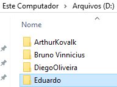
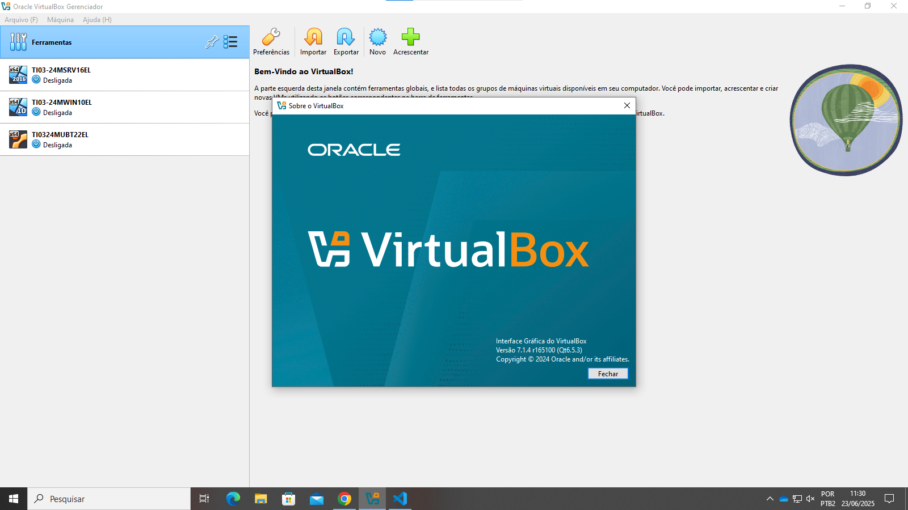

# Preparação de ambiente
Criar uma máquina virtual e instalar as ferramentas e dependências para o estudo de algoritimos e lógica de programação.

## Criar o diretório base
Vamos criar um diretório para guardar(armazenar) a nossa máquina virtual. Será criado no Drive D. Nomeada com o nome do usuário.

## Preparação da máquina virtual
### Vamos usar a ferramenta de virtualização chamada Virtual Box

<a href=https://www.virtualbox.org/wiki/Downloads>
