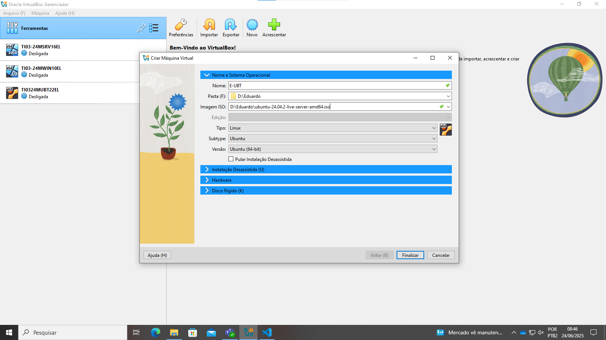
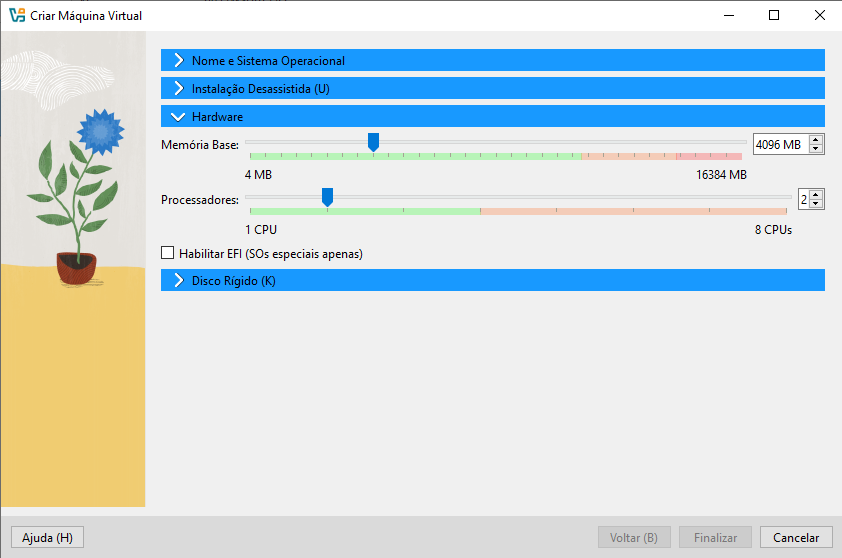
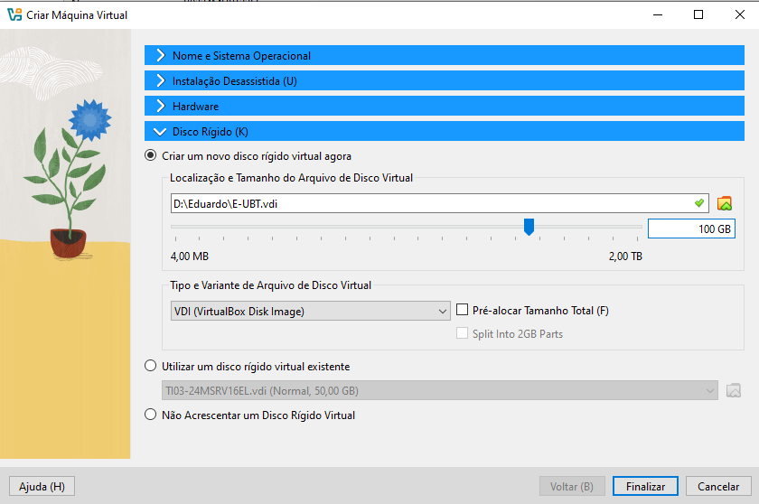
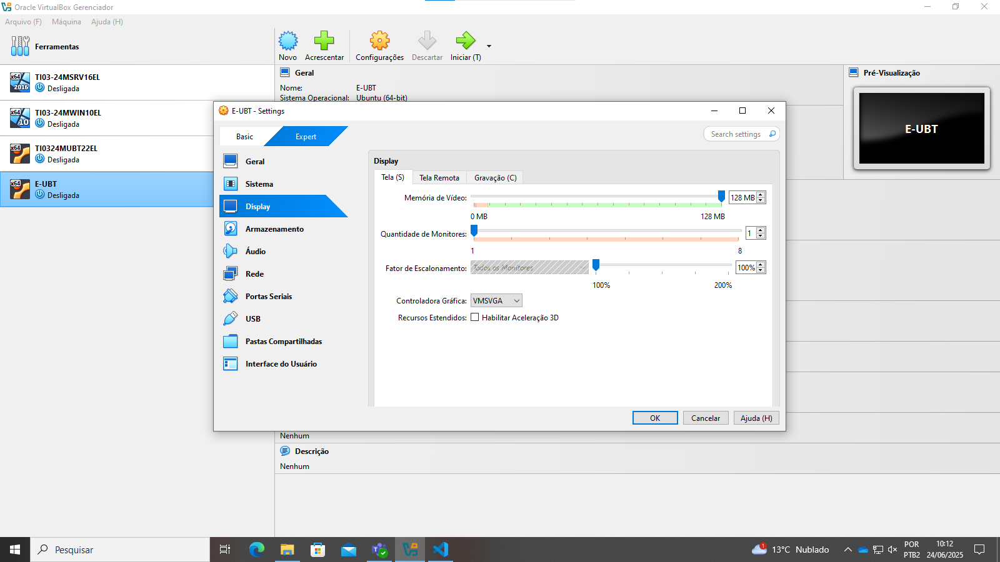
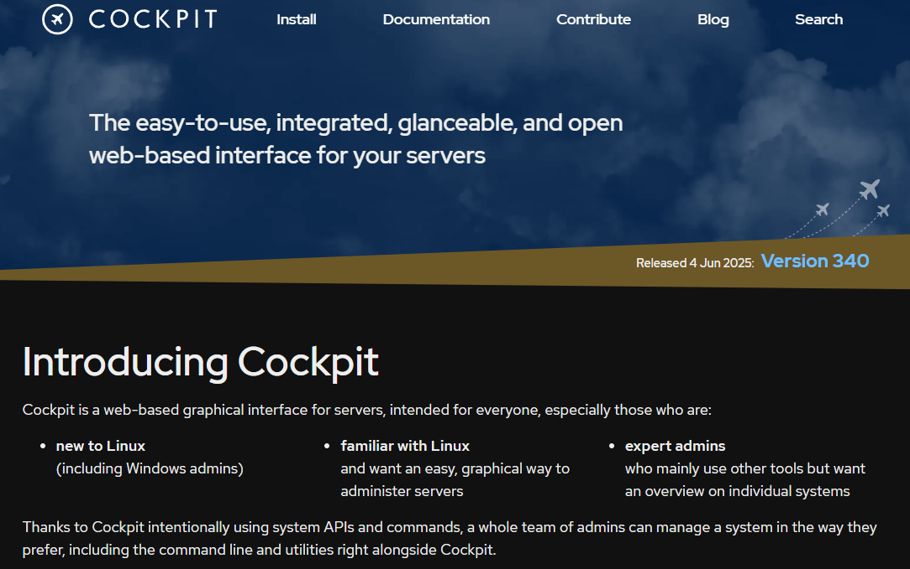

# Preparação de ambiente
Criar uma máquina virtual e instalar as ferramentas e dependências para o estudo de algoritimos e lógica de programação.

## Criar o diretório base
Vamos criar um diretório para guardar(armazenar) a nossa máquina virtual. Será criado no Drive D. Nomeada com o nome do usuário.


## Preparação da máquina virtual
### Vamos usar a ferramenta de virtualização chamada Virtual Box


<a href="https://www.virtualbox.org/wiki/Downloads"> Faça o download aqui! </a>

## Criando a máquina virtual
### Crie a máquina virtual usando as seguintes configurações:

- Depois de alocar a sua máquina virtual no diretório criado na unidade D ; 
- Selecione a imagem ISO, download abaixo ;

<a href="https://ubuntu.com/download/server"> Faça o download aqui! </a>



### Coloque: 
- 2 processadores ;
- 4096 de memória ;



- Mude o disco para: 100GB ;



### Agora, com a VM (Virtual Machine / Máquina Virtual) DESLIGADA!
- Altere a memória de vídeo para 128MB



## Pós concluir a instalação, para atualizar o sistema iremos usar os seguintes comandos:

```shell
sudo apt update -y
```

```shell
sudo apt upgrade -y
```


```shell
reboot
``` 

## Instalação do cockpit

Ferramenta para gerenciar o servidor, por meio de um ambiente gráfico online.



#### Comando para instalar o cockpit

```shell
sudo apt install cockpit -y
```
